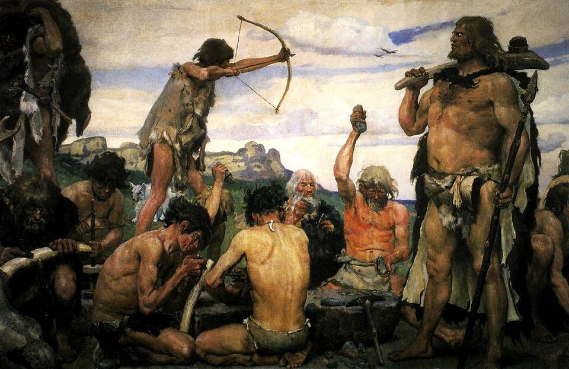
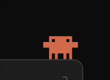
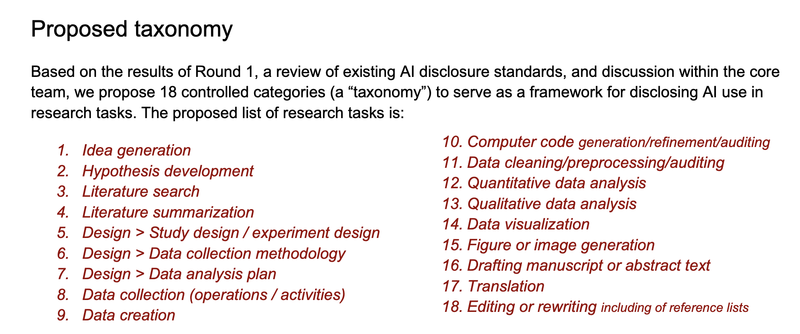
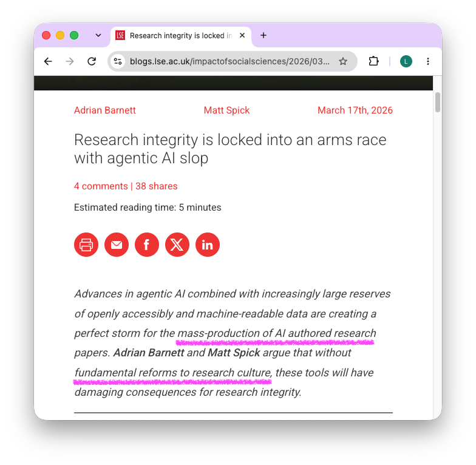
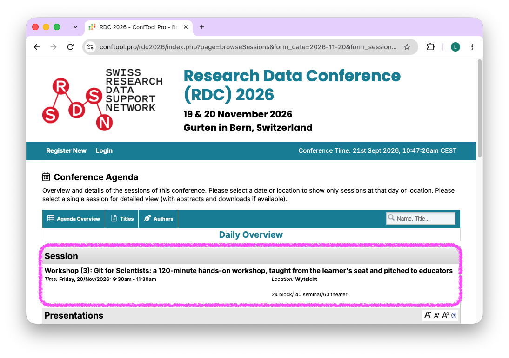

# 2023

::: notes
Git for Scientists, so that we can prove what is human. Remember 2023. This is what working on a computer felt like: set back to the stone age.
:::

## Digital Research in 2023

::: columns
::: {.column width="50%"}
- Git was hard
- Manuscripts live in DOCX
- Track changes record who did what, and disappear
:::

::: {.column width="50%"}
{fig-align="center" height="330"}

::: {.smallest}
Viktor Vasnetsov, Stone Age (detail). Public domain, via Wikimedia Commons.
:::
:::
:::

::: notes
Compare the workflows of 2023 with today, working with data, working with code, scientific workflows: almost everything has changed. What I want to say is that 2023 was a tough time to work with Git. We had the terminal window, maybe some graphical user interfaces with buttons. But for the average scientist who is not from IT, there was not enough time, resources, or motivation for these tools. The overhead was too large for the benefit that IT specialists, research software engineers, and data stewards kept promising.

[Whether a researcher knows Git or not, the manuscript sits in DOCX and the collaboration runs on track changes, which record who did what until someone clicks accept.]
:::

## Poll

Who has sent a document where AI was used?

Hands up for yes.

::: notes
[Ask, wait for the hands, say "keep them up".]
:::

## Poll

Who can prove which parts of the document were [generated by AI]{.accent}, and which parts [by a human]{.accent}?

::: notes
[Watch the hands. Do not explain yet; the next slide asks how.]
:::

## How do you prove it?

Ask yourself:

1. From memory?
2. Self documented?
3. Automated?

::: notes
- the first is hard
- the second cumbersome
- how could we do the third?
:::

# 2026

::: notes
Fast forward to 2026. Three years that feel like light years for scientific workflows.
:::

## Digital Research

::: columns
::: {.column width="55%"}
- Git is now a language prompt away
- Commits document the history of changes
- Issues document the history of decisions
- Your AI agent is your strongest collaborator
:::

::: {.column width="45%"}
{fig-align="center" height="330"}

::: {.smallest}
Clawd icon: [cleverhack.com/img/clawd.gif](https://cleverhack.com/img/clawd.gif) (copy in img/dsn-2026/clawd.gif).
:::
:::
:::

::: notes
We are in the midst of a transformation, and most of us don't know where it's heading. We don't have the answers yet. But one thing has changed: interacting with Git no longer needs an IT background. You use plain language prompts, just as with any other language. As we've seen, many of you have already sent documents that AI touched. So we have no excuse anymore not to teach everyone the principles of Git, and then reward them for using it in day-to-day scientific practice.
:::

## Declaration of AI

International Science Council. AI disclosure in research: towards a global reporting standard.

{fig-align="center" width="100%"}

::: notes
With reward, I mean the possibility to declare what is human, rather than the use of AI. These are the 18 boxes proposed for the next standard on declaring AI use in research. What I miss is turning it around. I cannot claim that AI hasn't touched all 18 areas of a paper I write. So it becomes ticking boxes, and not ticking one sends a different signal than the one we hope for.
:::

## Declaration of human

::: columns
::: {.column width="55%"}
- A paper in 30 minutes [@spick2026thirtyminute]
- Well documented open data makes it possible
- How do we prove our work? [@barnett2026armsrace]
:::

::: {.column width="45%"}
{fig-align="center" height="380"}
:::
:::

::: notes
An AI can now produce a paper from open data in 30 minutes. It has been tried, and it works. What is left for us, and how do we prove what we did? We can track every change to every file in a folder. We can show what we wrote, and what the agent wrote. The declaration becomes simple and automated: the history documents every change, and the issues document the tasks we planned for the AI and commented on. This is our opportunity.
:::

## Git for Scientists: teaching the need to know

So that we can prove what is human when working with AI in research.

- Read the tracked changes between two files (a diff)
- Understand how to experiment safely (a branch)
- Review what has gone into a set of changes (pull request)
- Know what should never enter a repository, or an AI tool

::: notes
[What is left to teach after the agent took the overhead fits a day: read a diff, review a pull request, know what never enters a repository. The third matters most. It has never been easier to paste personal data into a chat window.]
:::

## Git for Scientists: open educational resource

::: columns
::: {.column width="55%"}
- Handbook for how to set up and run the workshop
- Open, CC BY, for any steward to teach
- [gitforsci.github.io/website](gitforsci.github.io/website)
:::

::: {.column width="45%"}
{fig-align="center" height="330"}
:::
:::

::: notes
Our GitHub organisation carries the handbook for how we teach these workshops, so that anyone can build on them.
:::

## Git for Scientists: RDC 2026, Bern

::: columns
::: {.column width="50%"}
- Research Data Conference, 19 and 20 November 2026, Gurten, Bern
- 120-minute hands-on workshop, taught from the learner's seat and pitched to educators
- Friday 20 November, 9:30 to 11:30
- [Abstract](https://github.com/larnsce/rdc-2026/blob/main/abstract-workshop.md) and [ConfTool session](https://www.conftool.pro/rdc2026/index.php?page=browseSessions&form_date=2026-11-20&form_session=25&mode=table&presentations=hide)
:::

::: {.column width="50%"}
{fig-align="center" height="380"}
:::
:::

::: notes
[In November the workshop goes to the Research Data Conference in Bern: a 120-minute hands-on session, taught from the learner's seat and pitched to educators who want to teach it themselves.]
:::

## Agents for Scientists

Handing the need to know over to the AI

- Work safely: Git lets you revert
- Experiment freely: agentic AI opens endless possibilities
- First full-day workshop on 29 September

::: notes
Next week, on 29 September, we host our first full-day Agents
for Scientists workshop, with Claude Code.

Documenting the use of AI to produce scientific outputs is a cross-theme of the workshop.
:::

## FAIR by doing

::: columns
::: {.column width="55%"}
- 15 participants, 12 months, 5 workshops
- Git, GitHub, FAIR data publishing, agentic AI
- One day with Greg Wilson: Organizational Change for Open Science
- Anyone is welcome, especially qualitative researchers and people from non-IT backgrounds
- Express interest here
:::

::: {.column width="45%"}
{fig-align="center" height="330"}
:::
:::

::: notes
[FAIR by doing is a 12 month programme with five workshops on Git, GitHub, FAIR data publishing, and agentic AI.] After the basics, participants get a full day with Greg Wilson on Organizational Change for Open Science. If anyone in your groups could be interested, or aspiring data stewards and research software engineers who want to join this conversation on AI in research, they can express interest on this form. [Anyone is welcome, especially qualitative researchers and people from non-IT backgrounds.] We expect a decision by end of November or early December, then we pick up the conversation and see who joins. The programme starts in February 2027.
:::

## Thanks []{.accent} {#thanks}

::: {.columns}
::: {.column width="47%"}

::: {.kicker}
References
:::

- **These slides:** [download as PDF](https://github.com/Global-Health-Engineering/website/raw/main/slides/dsn-agentsforsci.pdf)
- **Built with Quarto and reveal.js:** [quarto.org/docs/presentations/revealjs](https://quarto.org/docs/presentations/revealjs/)

**Funding and support:** [Swiss Reproducibility Network (SwissRN)](https://www.swissrn.org/contents/community/nodes/) local node at ETH Zurich & [Data Stewardship Network at ETH Zurich](https://library.ethz.ch/en/researching-and-publishing/data-management-and-policies/research-data-management/data-stewardship.html), funded by the [swissuniversities Open Science Programme](https://www.swissuniversities.ch/en/topics/open-science/open-science-programme) & [Global Health Engineering group at ETH Zurich](https://ghe.ethz.ch/)

:::
::: {.column width="53%"}

::: {.kicker}
Resources
:::

- Git for Scientists Handbook: https://gitforsci.github.io/website
- Agents for Scientists: https://github.com/agentsforsci
- FAIR by doing proposal: https://github.com/Global-Health-Engineering/fair-training
- FAIR by doing expression of interest form: https://forms.gle/zx1eG7XSy8SAcenH8

:::
:::

::: {.foot}
All material is licensed under Creative Commons Attribution 4.0 International (CC BY 4.0).
:::

::: notes
Thank you for the opportunity to talk about this. I have always been passionate about Git for reproducibility, and it has always been hard for scientists to invest the time in it. Today we can change that, and we should all look at how we help scientists use it, for their own benefit. Thank you. This slide stays up for the discussion.
:::

## References

::: {#refs}
:::
