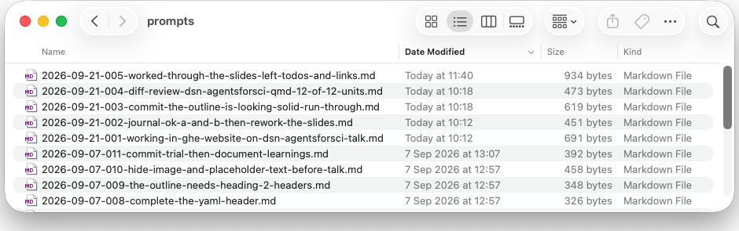
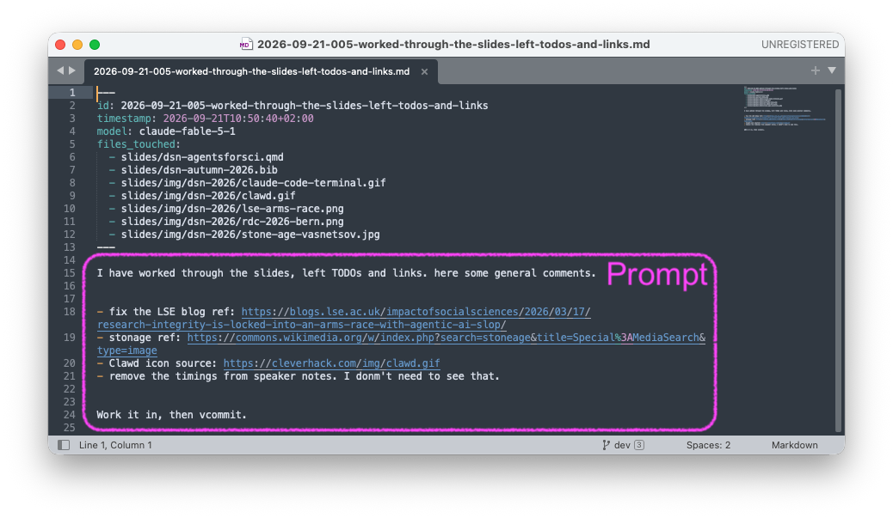
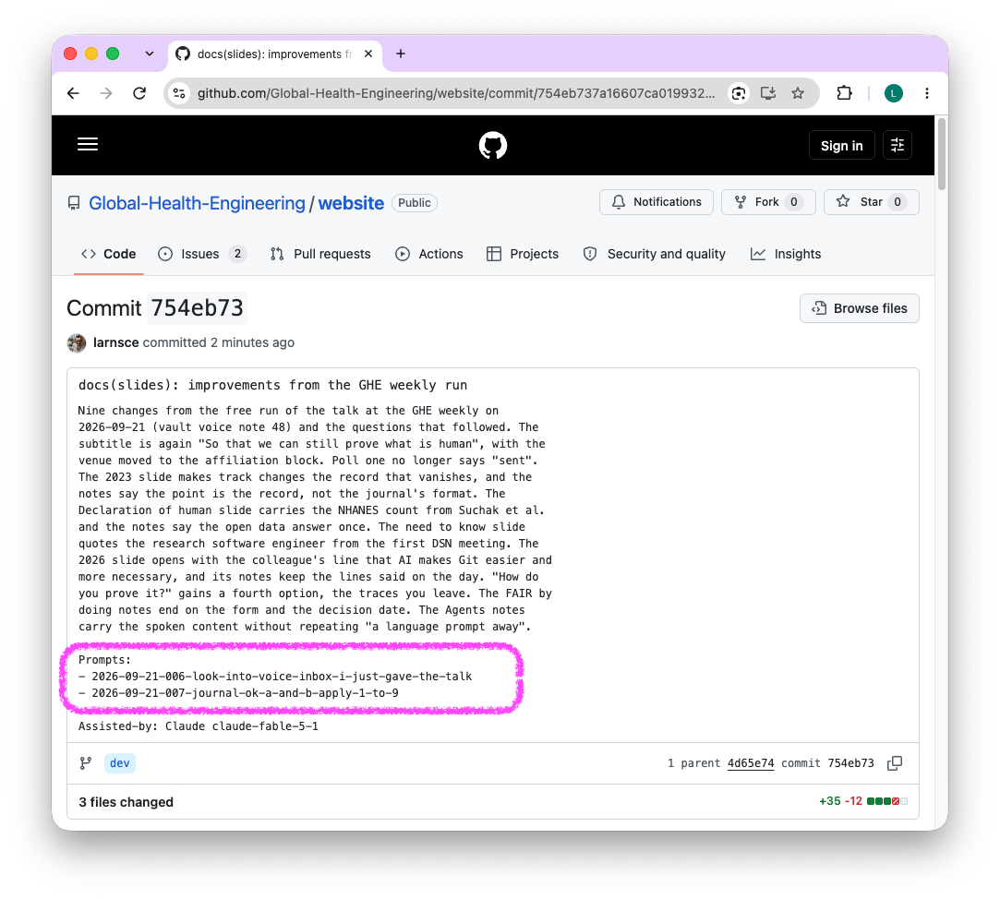

## {#title}

::: {.kicker}
Data Stewardship Network Autumn Community Meeting, ETH Zurich, 22 September 2026
:::

::: {.display}
Git for Scientists
:::

::: {.topic}
So that we can still [prove what is human]{.accent} when working with AI in research.
:::

::: {.foot}
Lars Schöbitz, Global Health Engineering, ETH Zurich, and SwissRN local node ETH Zurich. Slides: [ghe-open.ch/slides](https://ghe-open.ch/slides/)
:::

::: notes
Git for Scientists, so that we can still prove what is human.
:::

# 2023 {background-image="img/eth-kolloquium/silhouette.jpg" background-color="#000000"}

::: notes
Git for Scientists, so that we can prove what is human. Remember 2023. This is what working on a computer felt like: set back to the stone age.
:::

## Digital Research in 2023

::: columns
::: {.column width="50%"}
- Git was hard
- Manuscripts live in DOCX
- Track changes was the only record of who did what, and it vanishes on accept
:::

::: {.column width="50%"}
{fig-align="center" height="360"}
:::
:::

::: footer
Image: Viktor Vasnetsov, Stone Age (detail), public domain, via Wikimedia Commons
:::

::: notes
Compare the workflows of 2023 with today, working with data, working with code, scientific workflows: almost everything has changed. What I want to say is that 2023 was a tough time to work with Git. We had the terminal window, maybe some graphical user interfaces with buttons. But for the average scientist who is not from IT, there was not enough time, resources, or motivation for these tools. The overhead was too large for the benefit that IT specialists, research software engineers, and data stewards kept promising.

[This is about how change was recorded, not about the format journals ask for. Track changes was the only record of who did what among collaborators, and it vanishes when someone clicks accept. Git pins every change to a point in history.]
:::

## Poll

Has AI written part of a document you produced this month?

Hands up for yes.

::: notes
[Ask, wait for the hands, say "keep them up".]
:::

## Poll

Who can prove which parts of the document were [generated by AI]{.accent}, and which parts [by a human]{.accent}?

::: notes
[Watch the hands. Do not explain yet; the next slide asks how.]
:::

## How do you prove it?

Ask yourself:

1. From memory?
2. Self documented?
3. Automated?
4. From the traces you leave?

::: notes
- the first is hard
- the second cumbersome
- how could we do the third?
- the fourth is where the human shows: comments on issues and pull requests, reviews, drafts, sessions over time. Which traces prove the human? That is the question for the discussion.
:::

# 2026 {background-image="img/eth-kolloquium/silhouette.jpg" background-color="#000000"}

::: notes
Fast forward to 2026. Three years that feel like light years for scientific workflows.
:::

## Digital Research

AI makes Git easier to use, and more necessary.

::: columns
::: {.column width="55%"}
- Git is now a language prompt away
- Commits document the history of changes
- Issues document the history of decisions
- Your AI agent is your strongest collaborator
:::

::: {.column width="45%"}
{fig-align="center" height="330"}
:::
:::

::: footer
Image: Clawd icon, [cleverhack.com/img/clawd.gif](https://cleverhack.com/img/clawd.gif)
:::

::: notes
AI makes Git easier to use, and more necessary. One thing has changed: interacting with Git no longer needs an IT background. You use plain language: tell Git to make the commits, open a pull request, write issues. As the human you stay in the loop, and Git records what was done. As we've seen, AI has already written parts of your documents. So we have no excuse anymore not to teach everyone the principles of Git, and then reward them for using it in day-to-day scientific practice.
:::

## Declaration of AI

{fig-align="center" width="100%"}

::: footer
Image: International Science Council, AI disclosure in research: towards a global reporting standard, round 2 preparatory reading
:::

::: notes
With reward, I mean the possibility to declare what is human, rather than the use of AI. These are the 18 boxes proposed for the next standard on declaring AI use in research. What I miss is turning it around. I cannot claim that AI hasn't touched all 18 areas of a paper I write. So it becomes ticking boxes, and not ticking one sends a different signal than the one we hope for.
:::

## Declaration of human

::: columns
::: {.column width="55%"}
- A paper in 30 minutes [@spick2026thirtyminute]
- Well documented open data makes it possible
- How do we prove our work? [@barnett2026armsrace]
:::

::: {.column width="45%"}
{fig-align="center" height="380"}
:::
:::

::: footer
Image: Barnett and Spick, LSE Impact blog, 17 March 2026, [blogs.lse.ac.uk/impactofsocialsciences](https://blogs.lse.ac.uk/impactofsocialsciences/2026/03/17/research-integrity-is-locked-into-an-arms-race-with-agentic-ai-slop/)
:::

::: notes
An AI can now produce a paper from open data in 30 minutes. It has been tried, and it works: single-factor papers from the NHANES database went from about 4 a year to 190 in 2024. The things we have promoted for years, well documented open data, make paper mills possible. Say the answer once: the data stays open, and the repository records how it is used, by whom, and where. What is left for us, and how do we prove what we did? We can track every change to every file in a folder. We can show what we wrote, and what the agent wrote. The declaration becomes simple and automated: the history documents every change, and the issues document the tasks we planned for the AI and commented on. This is our opportunity.
:::

## Git for Scientists: teaching the need to know

So that we can prove what is human when working with AI in research.

::: incremental
- Read the tracked changes between two versions of a file [(a diff)]{.highlight-yellow}
- Understand how to experiment safely [(a branch)]{.highlight-yellow}
- Review what has gone into a set of changes [(a pull request)]{.highlight-yellow}
- Know what should never enter a repository, or an AI tool [(data security)]{.highlight-yellow}
:::

::: notes
[Three years ago, at the first DSN community meeting, a research software engineer said every PhD should be forced to learn Git, and we had a lively discussion. I agreed then and would have chosen a different approach than force. Force is no longer needed: the overhead is gone. What is left to teach after the agent took the overhead fits a day: read a diff, review a pull request, know what never enters a repository. The third matters most. It has never been easier to paste personal data into a chat window.]
:::

## Git for Scientists: open educational resource

::: columns
::: {.column width="55%"}
- Handbook for how to set up and run the workshop
- Open, CC BY, for any data steward or RSE to teach
- [gitforsci.github.io/website](https://gitforsci.github.io/website)
:::

::: {.column width="45%"}
{fig-align="center" height="330"}
:::
:::

::: footer
Image: QR code to [gitforsci.github.io/website](https://gitforsci.github.io/website)
:::

::: notes
Our GitHub organisation carries the handbook for how we teach these workshops, so that anyone can build on them.
:::

## Git for Scientists: RDC 2026, Bern

::: columns
::: {.column width="50%"}
- Research Data Conference, 19 and 20 November 2026, Gurten, Bern
- 120-minute hands-on workshop, taught from the learner's seat and pitched to educators
- Friday 20 November, 9:30 to 11:30
- [Abstract](https://github.com/larnsce/rdc-2026/blob/main/abstract-workshop.md) and [ConfTool session](https://www.conftool.pro/rdc2026/index.php?page=browseSessions&form_date=2026-11-20&form_session=25&mode=table&presentations=hide)
:::

::: {.column width="50%"}
{fig-align="center" height="380"}
:::
:::

::: footer
Image: RDC 2026 session page, [conftool.pro/rdc2026](https://www.conftool.pro/rdc2026/index.php?page=browseSessions&form_date=2026-11-20&form_session=25&mode=table&presentations=hide)
:::

::: notes
[In November the workshop goes to the Research Data Conference in Bern: a 120-minute hands-on session, taught from the learner's seat and pitched to educators who want to teach it themselves.]
:::

# Agents for Scientists {background-image="img/eth-kolloquium/silhouette.jpg" background-color="#000000"}

## Agents for Scientists

Handing the need to know over to the AI

- **Work safely**: Git lets you revert
- **Experiment freely**: agentic AI opens endless possibilities
- **Track AI use**: prompts and resulting changes are recorded 

First full-day workshop on 29 September.

::: notes
The mechanical work goes to the agent: make a commit, open a pull request, work on this branch, integrate someone else's changes. Work safely: the agent's changes can be reverted, which a chat cannot do. Experiment freely. Next week, on 29 September, we host our first full-day Agents for Scientists workshop, with Claude Code. Documenting the use of AI to produce scientific outputs is a cross-theme of the workshop. [Do not repeat "a language prompt away" here; it belongs to the 2026 slide.]
:::

## FAIR by doing

::: columns
::: {.column width="55%"}
- 15 participants, 12 months, 5 workshops
- Git, GitHub, FAIR data publishing, agentic AI
- One day with Greg Wilson: [Organizational Change for Open Science](https://third-bit.com/change/)
- Anyone is welcome, especially qualitative researchers and people from non-IT backgrounds

:::

::: {.column width="45%"}
Express interest here:
{fig-align="center" height="330"}
:::
:::

::: footer
Image: QR code to the expression of interest form, [forms.gle/zx1eG7XSy8SAcenH8](https://forms.gle/zx1eG7XSy8SAcenH8)
:::

::: notes
[FAIR by doing is a 12 month programme with five workshops on Git, GitHub, FAIR data publishing, and agentic AI.] After the basics, participants get a full day with Greg Wilson on Organizational Change for Open Science. Anyone at ETH is welcome, especially qualitative researchers and people from non-IT backgrounds: they would start using these tools last, and can benefit just as much now. Express interest through the QR, and pass it on to the researchers you support. Decision by early December, then we pick up the conversation. The programme starts in February 2027.
:::

# Declaration of AI use {background-image="img/eth-kolloquium/silhouette.jpg" background-color="#000000"}

## A prompts folder in every repository

{fig-align="center" height="360"}

- Every prompt recorded, one Markdown file each. This is the prompts folder of these slides.

::: footer
Image: the prompts folder of [github.com/Global-Health-Engineering/website](https://github.com/Global-Health-Engineering/website/tree/main/prompts)
:::

::: notes
I have experimented with the idea of documenting the process of creation for a while now. Since about May 2026, I record every prompt to Claude Code alongside the files in a repository. This is the prompts folder for the repository where these slides are stored.
:::

## One file per prompt

{fig-align="center" height="360"}

::: footer
Image: prompts/2026-09-21-005-worked-through-the-slides-left-todos-and-links.md in the same repository
:::

::: notes
- An id and a timestamp
- The model that was used
- The files in the repository that were touched
- The prompt itself, verbatim, at the bottom
:::

## A commit skill {.small-title}

{fig-align="center" height="470"}

::: footer
Image: [github.com/Global-Health-Engineering/website/commit/754eb73](https://github.com/Global-Health-Engineering/website/commit/754eb73)
:::

::: notes
- Claude Code makes the commit in a standard way
- The commit message names the prompt files behind it
- And the model that assisted
:::

## Let the AI declare

> "Use the traces of commits, prompt folders, and pull requests to declare the use of AI against the ETH guidelines for the declaration of AI."

::: notes
I can now prompt: use the traces of commits, prompt folders, and pull requests to declare the use of AI against the ETH guidelines for the declaration of AI. The declaration is generated from the record, not written from memory.
:::

## Thanks []{.accent} {#thanks}

::: {.thanks}
::: {.columns}
::: {.column width="47%"}

::: {.kicker}
References
:::

- **These slides:** [download as PDF](https://github.com/Global-Health-Engineering/website/raw/main/slides/dsn-agentsforsci.pdf)
- Built with [Quarto](https://quarto.org/docs/presentations/revealjs/) and reveal.js

**Funding and support:** [SwissRN](https://www.swissrn.org/contents/community/nodes/) local node ETH Zurich and the [Data Stewardship Network](https://library.ethz.ch/en/researching-and-publishing/data-management-and-policies/research-data-management/data-stewardship.html) at ETH Zurich, funded by the [swissuniversities Open Science Programme](https://www.swissuniversities.ch/en/topics/open-science/open-science-programme), and [Global Health Engineering](https://ghe.ethz.ch/), ETH Zurich

:::
::: {.column width="53%"}

::: {.kicker}
Resources
:::

- [Git for Scientists handbook](https://gitforsci.github.io/website)
- [Agents for Scientists](https://github.com/agentsforsci)
- [FAIR by doing proposal](https://github.com/Global-Health-Engineering/fair-training)
- [FAIR by doing: expression of interest form](https://forms.gle/zx1eG7XSy8SAcenH8)

:::
:::

::: {.foot}
All material licensed [CC BY 4.0](https://creativecommons.org/licenses/by/4.0/).
:::
:::

::: notes
Thank you for the opportunity to talk about this. I have always been passionate about Git for reproducibility, and it has always been hard for scientists to invest the time in it. Today we can change that, and we should all look at how we help scientists use it, for their own benefit. Thank you. This slide stays up for the discussion.
:::

## References

::: {#refs}
:::
