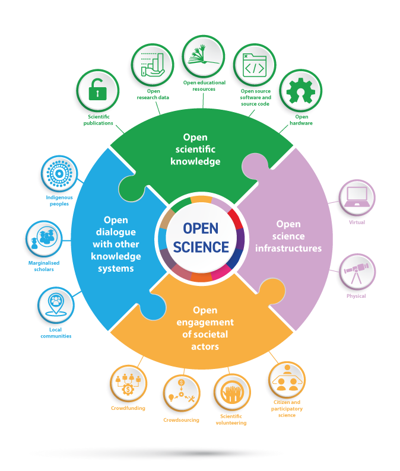

<!--
DSN Autumn Community Meeting, 2026-09-22, slot around 14:40, 8 minutes,
10 minutes discussion, hybrid. Fourteen slides. Each notes block starts
with the target clock time. Plan to 7:30, silent timer at 6:30.
Rule for the slide text: three bullets, three to five words each. The
longer sentences live in the notes. Cut order if a rehearsal runs over:
say slide 9 while slide 8 is up, then drop the 2023 column detail.
Lines marked TODO need a fact or a file before the talk.
-->

<!--
Trial run at the GHE weekly, 2026-09-07 (vault voice note 38, wiki page
wiki/teaching/dsn-autumn-2026-talk). Given from this outline before the
images existed. The talk proper ran 11:16 against the 8 minute target.

Timing by slide, planned / actual:
  intro before the polls        0:00 / 0:33   (host introduces at DSN, cut)
  two polls                     0:40 / 0:41
  researchers' reality          0:20 / 0:26
  open science culture          1:00 / 0:58
  agents made it cheap          0:40 / 0:58
  humans keep the important     0:30 / 0:47
  left to teach, data security  0:40 / 1:29   (grew into a guardrails talk)
  the line                      0:20 / 0:38   (stalled on "not worked out yet")
  the only record               0:20 / 0:27
  declaration boxes, said early 0:00 / 0:31   (then said again on declare or prove)
  the 30 minute paper           1:00 / 0:56   (no number given)
  declare or prove              1:00 / 0:58
  FAIR by doing                 0:30 / 0:37
  GFRN and the DSN ask          0:30 / 1:06   (aside about the previous week)

Learnings for the next version:
- The one idea, "a declaration says what the AI did, an audit trail
  proves what the human did", was said five times. Build outward from it.
- Write a script and rehearse it; mostly images, far fewer words.
- Replace the second poll with the four level scale of proof: from
  memory, from the artifacts, from the record, public and per prompt.
  All hands stayed up on the yes/no version.
- Keep the line said on the day: "letting others watch you while you're
  doing it, because you make decisions differently".
- Put one number on the paper mill slide (4 a year to 190 in 2024).
- Say the open data answer aloud: data stays open, the repository
  records how it is used.
- Make the declaration point once, on the declare or prove slide.
- Cut the intro and the aside in the close. Plan to 7:30, timer at 6:30.
-->

## Poll

Has AI touched a document you sent this month?

Hands up for yes.

::: notes
0:00. Ask, wait for the hands, say "keep them up".
:::

## Poll

Could you show which paragraph, which code, which figure?

Keep them up.

::: notes
0:20. Watch the hands drop. Name it in one sentence: that gap is what
this talk is about. Do not explain yet.
:::

## Researchers' reality

- Manuscripts live in DOCX
- Track changes is the record
- Git stayed with the coders

<!-- TODO: Don't show the placeholder texgt -->

<!-- IMAGE: a DOCX file icon with track changes beside a black terminal window, side by side, no caption. File: img/dsn-2026/docx-vs-terminal.png. Replace this block with `` or two images in `::: columns` -->

::: notes
0:40. Whether a researcher knows Git or not, the manuscript sits in DOCX
and the collaboration runs on track changes. Git stayed with the coders
because the overhead was too much to ask of anyone else.
:::

## Open science is a way of working

::: columns
::: {.column width="55%"}
{fig-align="center" height="400"}
:::

::: {.column width="45%"}
- Not a tick box
- Share the process, not only the product
- Be transparent, be vulnerable

The process lived in DOCX, where nobody could see it.
:::
:::

::: notes
1:00. Point at the UNESCO figure: it is overwhelming and it misses the
essence. Open science is not a tick box of whether the content is open.
It is a culture of openness: sharing the process of doing research
rather than the end product, being transparent, making yourself
vulnerable. The bridge is the last line: the process lived in DOCX,
where nobody could see it. That is why the next slide matters.
:::

## Agents made it cheap

::: columns
::: {.column width="50%"}
**2023 without AI**

- an unforgiving terminal
- clone, branch, stage
- message, push, PR text
- conflicts
:::

::: {.column width="50%"}
**2026 with AI**

- say what you want
- read what was done
- comment on it
- integrate
:::
:::

<!-- GIF or IMAGE (optional): left column a terminal with the seven manual steps scrolling past; right column a single sentence typed to an agent and the pull request that came back, browser at 200 percent zoom. File: img/dsn-2026/2023-vs-2026.gif. Replace this block with ``. If a still is enough, use one screenshot of the pull request page instead -->

::: notes
2:00. Seven places to get stuck against four things a human does. Same
repository, same record. This slide carries the point on its own; do
not read the columns, point at the length difference.
:::

## Humans keep the important parts

- Agents do the mechanics
- Humans validate, correct, approve
- Git tracks all of it

<!-- IMAGE (optional): screenshot of a pull request review with one approving comment, browser at 200 percent zoom, cropped to the comment. File: img/dsn-2026/pr-review-comment.png. Replace this block with `` -->

::: notes
2:40. The division of labour: the agent does the mechanics, the human
does validation, correction, and approval, and with Git every one of
those decisions is tracked and documented.
:::

## Left to teach, on a need to know basis

- Read a diff
- Review a pull request
- Know what never enters a repository

It was never easier to paste it into a chat window.

<!-- TODO one line on the Git for Scientists open educational resource (CC BY, DOI); check the publication status first. -->

<!-- IMAGE: screenshot of a chat window with the prompt "here is my data, analyse it" and a spreadsheet pasted below it; blur any real names. File: img/dsn-2026/prompt-here-is-my-data.png. Replace this block with `` -->

::: notes
3:10. This is the slide the agenda title promised: teaching on a need
to know basis. What remains after the agent took the overhead fits a
day. The third bullet is the most important one. Not using Git made
data security invisible, and it has never been easier to paste
sensitive, personal content into a chat window, which is why data
security training became the most important part of the workshop. Name
the OER here: the July workshop material, open, for any steward to run.
:::

## Line

> "Every PhD should be forced to learn Git"

<!-- TODO who said it, at which DSN community event, month and year. -->

<!-- IMAGE (optional): a photo of the DSN community event or the ETH room where the line was said; otherwise leave the quote alone on a dark background. File: img/dsn-2026/dsn-event-photo.jpg. Replace this block with `` -->

::: notes
3:50. I agreed then, and would have chosen a different approach than
force. Sadly, force might have been the only way. That has changed. We
can finally sell it.
:::

## The only record

The only record that can tell their work from the machine's.

::: notes
4:10. Code and reproducibility are one reason to learn Git. The reality
now is that the record is the only thing that can tell a researcher's
work from the machine's. Say it once, then move to why.
:::

## A new paper in 30 minutes

- A paper in 30 minutes [@spick2026thirtyminute]
- Fake papers mined from open data [@suchak2025explosion; @maupin2025dramatic]
- Journals ask for proof of human work [@barnett2026armsrace]

<!-- IMAGE: screenshot of the first page of Suchak et al. 2025 (PLOS Biology) or of the LSE post title "Research integrity is locked into an arms race with agentic AI slop"; add the NHANES counts as a small chart if there is time: about 4 a year to 2021, 33 in 2022, 82 in 2023, 190 in 2024. File: img/dsn-2026/paper-mill-screenshot.png. Replace this block with `` -->

::: notes
4:30. One group at Surrey has shown it: an agent produces a plausible
new paper in 30 minutes, NHANES single factor papers went from about 4
a year to 190 in 2024, and a two hour rewrite passes the plagiarism
check. Their ask to journals is evidence that the work was not instantly
created. That is a step up from declaring AI use, and a good one.
Discussion answer if asked how open science squares with open data
feeding paper mills: the data stays open, and the repository records
how it is used, by whom, and where. An audit trail, not a control.
:::

## Declare, or prove

- Tick boxes, filled from memory
- My papers tick every box
- Show the workflow instead

<!-- IMAGE: screenshot of the 18 AI task categories from the WCRI round 2 preparatory reading (v4.5, page 6), cropped to the grid of boxes. File: img/dsn-2026/wcri-18-boxes.png. Replace this block with `` -->

::: notes
5:30. The current development on AI declaration goes towards tick
boxes, filled from memory. I think that is counterproductive. The papers
I write tick every box today; I cannot claim that AI has not influenced
my idea generation. Does it not matter more that I show the workflow:
dated commits, prompts, human drafts, literature notes, a compounding
knowledge base, and that I am public and transparent by sharing those
artifacts alongside the paper? A declaration says what the AI did. An
audit trail proves what the human did.
:::

## FAIR by doing

- 15 researchers, 12 months, own data
- A test bed for proving human work
- Express interest here

<!-- TODO the repository is private today: either make it public before the talk or say "under version control, with an AI declaration". -->

<!-- IMAGE: QR code that opens the FAIR by doing expression of interest form, with the short URL printed under it; a screenshot of the form header can sit beside it. File: img/dsn-2026/qr-fair-by-doing.png. Replace this block with `` -->

::: notes
6:30. We submitted a proposal to train 15 researchers over 12 months
with their own data, and to use those 12 months as an experimental
setup for researching the declaration of AI, or rather the declaration
of the human's involvement. The proposal was developed under version
control with an AI declaration. Interest can be expressed through the
form; please share it with the researchers you support.
:::

## One response from the DSN

- GFRN AI working group, WCRI round 2
- Due 16 October, collective responses preferred
- I host the first meeting

<!-- IMAGE: QR code that opens the WCRI round 2 consultation page or the preparatory reading, with the date 16 October 2026 printed under it. File: img/dsn-2026/qr-wcri-round-2.png. Replace this block with `` -->

::: notes
7:00. I am working with the Global Federation of Reproducibility
Networks' AI working group on the submission to round 2 of the WCRI
consultation on AI disclosure. As the Data Stewardship Network we have
the opportunity to submit as one collective voice, which the initiative
prefers. I would love to host a meeting where we discuss a combined
submission. A collective, open response is the culture from slide four
in miniature.
:::

## Thanks

<!-- IMAGE: both QR codes side by side, FAIR by doing on the left and the WCRI round 2 consultation on the right, so the slide can stay up during the discussion. File: img/dsn-2026/qr-both.png. Replace this block with `` -->

::: notes
7:30. Stop. This slide stays up for the discussion.
:::

## References

::: {#refs}
:::
