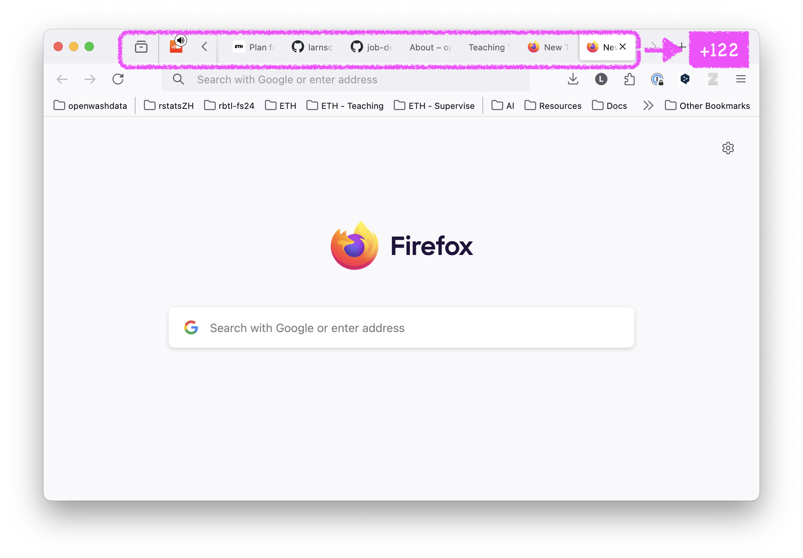
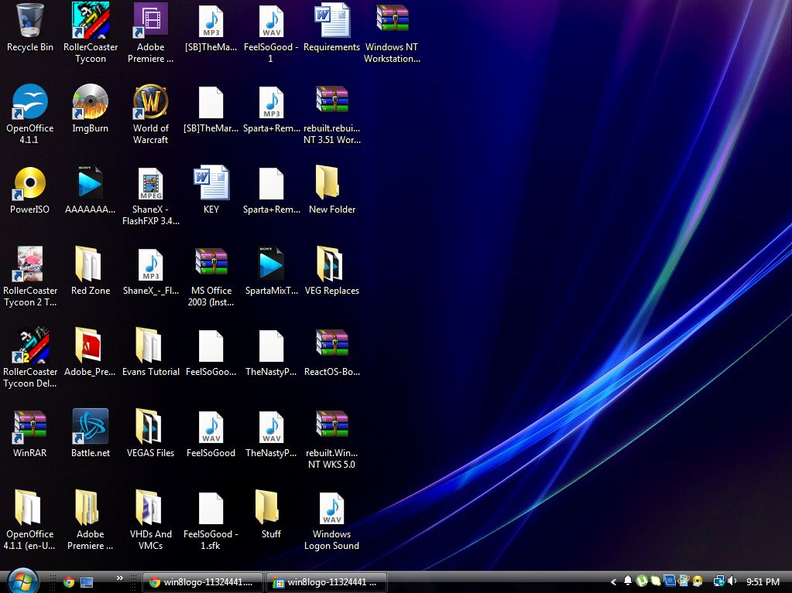
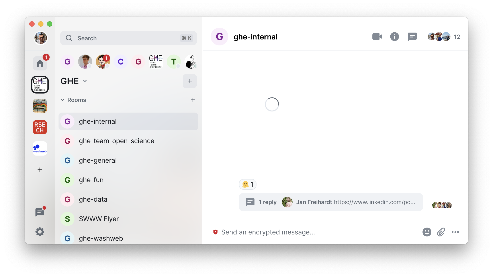
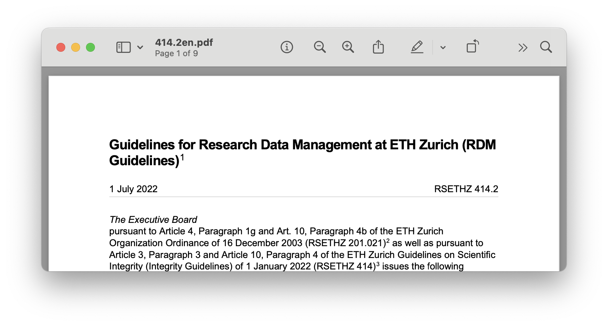
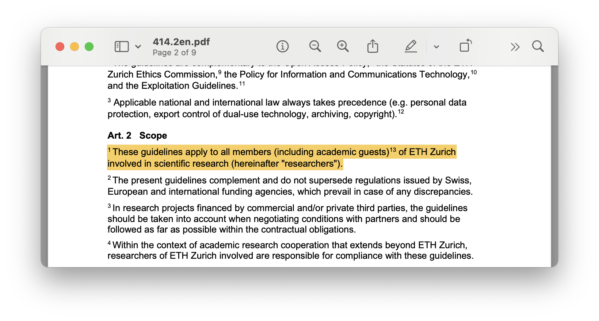
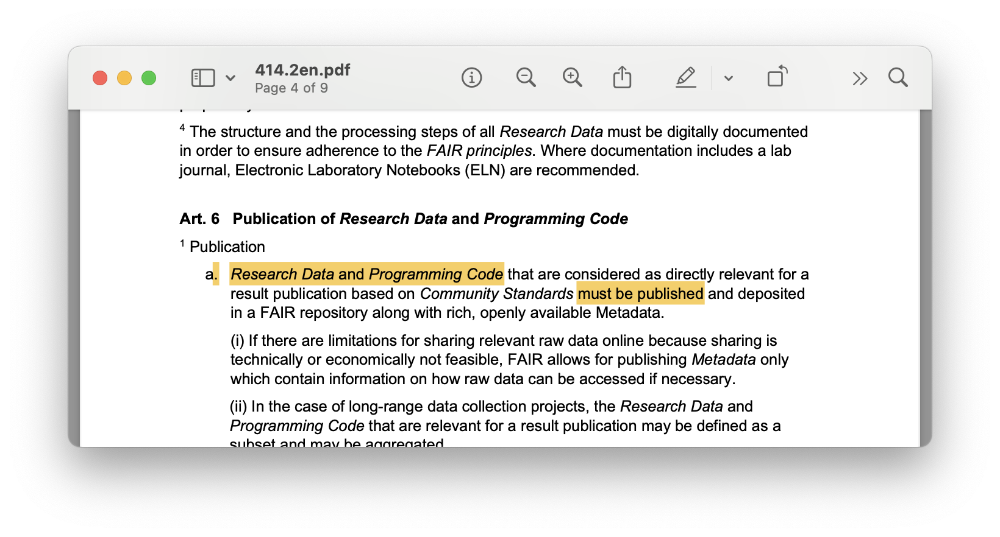
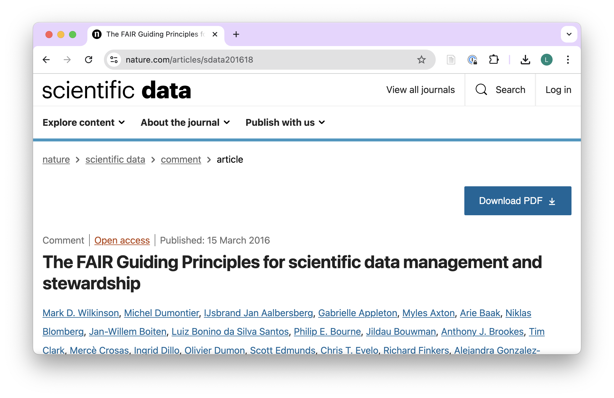
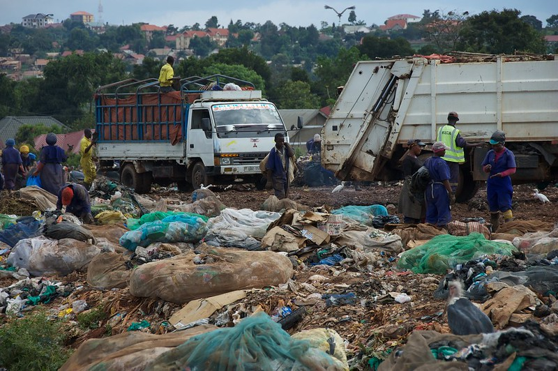

```{r}
library(ghedata)
library(ggthemes)
library(tidyverse)
library(ggtext)
library(gt)
```

# Meet a data steward {background-image="img/eth-kolloquium/silhouette.jpg" background-color="#000000"}

## Meet a data steward {.smaller}

::: incremental

::: columns
::: {.column width="50%"}
**I have:**

-   10+ years work experience (5 in research, at Eawag)
-   empathy, compassion, patience, persistence
-   an affinity for IT
-   teaching experience
-   learned how people learn
:::

::: {.column width="50%"}
**I don't have:**

-   a doctoral degree
-   a qualification in computer science
-   a qualification in statistics
-   a lot of time
:::
:::

:::

::: footer
Job Description: [Open Science Specialist](https://github.com/Global-Health-Engineering/job-descriptions/blob/main/open-science-specialist/README.md)
:::

::: notes
My role - **Open Science Specialist**

-   research data management
-   reproducible workflows
-   mindset for Open Science
-   research communication
-   teaching data science tools
-   proposal writing
:::

# 8 learnings from 4 years {background-image="img/eth-kolloquium/silhouette.jpg" background-color="#000000"} 

# #1 Technology is not on our side {background-image="img/eth-kolloquium/silhouette.jpg" background-color="#000000"}

## The Modern Academic's Challenges 

::: columns
::: {.column width="50%"}
- Overflowing email inboxes
- Browsers with hundreds of tabs
- Files on stored on Desktops
- MS Teams, Slack, Element, NAS, Google Drive, ...
- Credentials, Passwords, OTPs, 2FAs, PATs, ... 
:::

::: {.column width="50%"}

::: fragment

{.absolute top=50 right=50 width="350" height="300"}

:::

::: fragment

{.absolute top=50 right=50 width="450" height="250"}

:::

::: fragment

{.absolute bottom=0 right=50 width="400" height="300"}
::: 

::: fragment

{.absolute bottom=0 right=50 width="450" height="300"}
::: 

:::
:::

# #2 ETH wants reproducibility {background-image="img/eth-kolloquium/silhouette.jpg" background-color="#000000"}

## ETH RDM Guidelines [(2022)]{.highlight-yellow}

{.absolute}

::: fragment

{.absolute}
:::

::: fragment

{.absolute}
:::

::: footer
ETH RDM Guidelines (2022): <https://rechtssammlung.sp.ethz.ch/Dokumente/414.2en.pdf>
:::


## FAIR data sharing principles

{.absolute}

::: footer
Article accessible at: <https://www.nature.com/articles/sdata201618>
:::

## {style="text-align: center;"}

 

## FAIR data sharing principles

::: columns
::: {.column width="50%"}
- Technical in nature
- Require data management strategy to establish workflows
- Not a checkbox, but a process
:::
::: {.column width="50%"}


:::{.large}
`F`indable
`A`ccessible
`I`nteroperable
`R`eusable
:::
:::
:::

## ETH FAIR Coalition [(2025)]{.highlight-yellow}

**Newly established institution-wide initiative**

- Launched by the VPs for Research and Infrastructure
- Coalition Charter open for researchers and staff to sign
- Research units invited to formally join in spring 2026
- FAIR summit and three further initiatives launching summer 2026

::: footer
ETH FAIR Coalition: <https://ethz.ch/en/research/open-science/FAIR-Coalition.html>
:::

# #3 Data management is project management {background-image="img/eth-kolloquium/silhouette.jpg" background-color="#000000"}

## 

```{r}
#| out-width: "100%"

undergrad_students <- people |> 
  filter(b_m_student == "yes") |>
  filter(!is.na(title)) 

undergrad_students |> 
  count(degree, year) |> 
  mutate(degree = case_when(
    degree == "bsc" ~ "BSc thesis",
    degree == "msc" ~ "MSc thesis"
  )) |>
  ggplot(aes(x = year, y = n, label = n, fill = degree)) +
  geom_col(position = "dodge") +
  geom_label(position = position_dodge(width = 0.9),
            show.legend = FALSE,
            color = "white",
            fontface = "bold",
            size = 6) +
  labs(x = "",
       y = "Number of thesis projects", 
       fill = "Project:") +
  scale_fill_colorblind() +
  scale_color_colorblind() +
  theme(panel.grid = element_blank(),
        axis.text.y = element_blank()) +
  statR::theme_stat(base_size = 16) 
  

```

::: notes
- already 26 students this year
- Essentially managed by one senior scientist and a professort, who makes the effort to see students regularly, in person
- This requires project management
:::

::: footer
Access anonymised data from [`ghedata`](https://global-health-engineering.github.io/ghedata/)
:::

## GHE Student Wiki ([public](https://unlimited.ethz.ch/spaces/ghestudents/pages/182075673/GHE+students+Wiki))

::: columns
::: {.column width="55%"}

- Grading criteria
- Communication expectations
- Data storage and data management guidelines
- Presentation standards
- Proposal and thesis writing requirements

:::

::: {.column width="45%"}

```{r}
knitr::include_graphics(here::here("slides/img/eth-kolloquium/ghe-student-wiki.png"))
```

:::
:::

::: footer
[Blog: Empowering Students: The Role of Transparency at Global Health Engineering](https://ghe.ethz.ch/ghe-blog-news/2024/10/blog-empowering-students-the-role-of-transparency-at-global-health-engineering.html)
:::

::: footer
Transparent grading practices and clear expectations offer several advantages:

1. Improved student performance: When students understand what is expected of them, they are better equipped to meet those expectations.

2. Reduced anxiety: Clear guidelines help alleviate student stress and uncertainty about assignments and evaluations.

3. Fairness: Transparent grading criteria ensure that all students are evaluated consistently and equitably.

4. Enhanced learning: Students can focus on learning objectives rather than guessing what the supervisor wants.
:::

## Grading rubric & data publication {.smaller}

::: columns
::: {.column width="40%"}

**Four areas of evaluation with 31 sub-areas**

- 40/100: Research competence
- 40/100: Thesis report
- 10/100: Colloquium
- 10/100: Examination

:::

::: {.column width="60%"}

::: fragment

**'Data Management' under 'Research Competence'**

> 6: Data is fully documented, organized, easy to reproduce, and publication ready. Everything is stored on Google Drive.


:::

::: fragment

**But, data publication requirement**

> Obtaining a 6 from all sub-areas but not publishing the data in the form of a repository will result in a maximum allowed grade of 5.75.

:::
:::
:::

::: footer
Our [Grading rubrics](https://unlimited.ethz.ch/spaces/ghestudents/pages/182077233/Grading+rubrics)
:::

# #4 Low IT affinity is not a lack of aptitude {background-image="img/eth-kolloquium/silhouette.jpg" background-color="#000000"} 

## Safe learning environments 

::: columns
::: {.column width="50%"}

**Growth-mindset for better learning outcomes**

-  **Fixed mindset**: 'I'm not good'
-  **Growth mindset**: 'I can learn'

:::

::: {.column width="50%"}

::: fragment

**Create safe learner environments**

- Regular 1:1 research data management meetings
- Bi-monthly half day team events
- Yearly retreat 

:::

:::
:::

::: footer
Access our [Strategy & Planning](https://ghe.ethz.ch/open-science/strategy-and-planning.html)
:::

::: notes

If people believe that competence in some area is intrinsic (i.e. that you either “have the gene” for it or you don’t), everyone does worse, including the supposedly advantaged. The reason is that if someone doesn’t do well at first, they assume that they lack that aptitude, which biases their future performance.

From: https://teachtogether.tech/en/index.html#s:motivation

:::

# #5 Data != Data {background-image="img/eth-kolloquium/silhouette.jpg" background-color="#000000"}

## Disclaimer: Data at GHE {.smaller}

::: columns
::: {.column width="40%"}
-   small (few MBs)
-   tabular
-   non-sensitive
-   topics
    -   waste management
    -   sanitation
    -   air quality
    -   etc.
:::

::: {.column width="60%"}



:::
:::

::: footer
Photo: [Kiteezi Landfill, Kampala, Uganda](https://www.flickr.com/photos/110829077@N08/15704065265/in/album-72157649056083306/)
:::

## Three terms for three stages {.smaller}

## Three terms for three stages {.smaller}

| term                                   | explanation                                                                                 | file format                     |
|--------------------|-----------------------|------------------------------|
| unprocessed [raw]{.highlight-yellow} data | data that is not processed and [remains in its original form and file type]{.highlight-yellow} | often XLSX, also CSV and others |

: {.striped tbl-colwidths="\[20, 60, 20\]"}

## Three terms for three stages {.smaller}

| term                                            | explanation                                                                                                       | file format                     |
|--------------------|-----------------------|------------------------------|
| unprocessed [raw]{.highlight-yellow} data          | data that is not processed and [remains in its original form and file type]{.highlight-yellow}     | often XLSX, also CSV and others |
| [processed]{.highlight-yellow} analysis-ready data | data that is processed to [prepare for an analysis]{.highlight-yellow} and is exported in its new form as a new file | CSV, R data package             |

: {.striped tbl-colwidths="\[20, 60, 20\]"}

## Three terms for three stages {.smaller}

| term                                                  | explanation                                                                                                                                                                                  | file format                     |
|--------------------|-----------------------|------------------------------|
| unprocessed [raw]{.highlight-yellow} data                | data that is not processed and [remains in its original form and file type]{.highlight-yellow}                                                                                | often XLSX, also CSV and others |
| [processed]{.highlight-yellow} analysis-ready data       | data that is processed to [prepare for an analysis]{.highlight-yellow} and is exported in its new form as a new file                                                                            | CSV, R data package             |
| [final]{.highlight-yellow} data underlying a publication | data that is the [result of an analysis]{.highlight-yellow} (e.g descriptive statistics or data visualization) and shown in a publication, but then also exported in its new form as a new file | CSV                             |

: {.striped tbl-colwidths="\[20, 60, 20\]"}

# #6 Data management is a process, not a checkbox {background-image="img/eth-kolloquium/silhouette.jpg" background-color="#000000"} 

##  {background-image="img/eth-kolloquium/ghe-rdm-workflow-01.drawio.svg" data-background-size="contain" data-background-position="center"}

##  {background-image="img/eth-kolloquium/ghe-rdm-workflow-02.drawio.svg" data-background-size="contain" data-background-position="center"}

##  {background-image="img/eth-kolloquium/ghe-rdm-workflow-03.drawio.svg" data-background-size="contain" data-background-position="center"}

##  {background-image="img/eth-kolloquium/ghe-rdm-workflow-04.drawio.svg" data-background-size="contain" data-background-position="center"}

##  {background-image="img/eth-kolloquium/ghe-rdm-workflow-05.drawio.svg" data-background-size="contain" data-background-position="center"}

##  {background-image="img/eth-kolloquium/ghe-rdm-workflow-06.drawio.svg" data-background-size="contain" data-background-position="center"}

##  {background-image="img/eth-kolloquium/ghe-rdm-workflow-07.drawio.svg" data-background-size="contain" data-background-position="center"}

##  {background-image="img/eth-kolloquium/ghe-rdm-workflow-08.drawio.svg" data-background-size="contain" data-background-position="center"}

##  {background-image="img/eth-kolloquium/ghe-rdm-workflow-09.drawio.svg" data-background-size="contain" data-background-position="center"}

##  {background-image="img/eth-kolloquium/ghe-rdm-workflow-10.drawio.svg" data-background-size="contain" data-background-position="center"}

##  {background-image="img/eth-kolloquium/ghe-rdm-workflow-11.drawio.svg" data-background-size="contain" data-background-position="center"}

##  {background-image="img/eth-kolloquium/ghe-rdm-workflow-12.drawio.svg" data-background-size="contain" data-background-position="center"}

##  {background-image="img/eth-kolloquium/ghe-rdm-workflow-13.drawio.svg" data-background-size="contain" data-background-position="center"}

##  {background-image="img/eth-kolloquium/ghe-rdm-workflow-14.drawio.svg" data-background-size="contain" data-background-position="center"}

# #7 Findable: Publish for humans and computers {background-image="img/eth-kolloquium/silhouette.jpg" background-color="#000000"} 

## {background-image="img/eth-kolloquium/01-ghe-article.png" data-background-size="contain" data-background-position="center"}

::: footer
<https://doi.org/10.4209/aaqr.240095>
:::

## {background-image="img/eth-kolloquium/02-ghe-article-data-statement.png" data-background-size="contain" data-background-position="center"}

::: footer
<https://doi.org/10.4209/aaqr.240095>
:::

## {background-image="img/eth-kolloquium/01-findable-ghe-publications-data.png" data-background-size="contain" data-background-position="center"}

[Automation from ETH Research Collection]{style="position: absolute; top: 35%; left: 50%; transform: translate(-50%, -50%) rotate(-15deg); padding: 20px; background-color: #ede8d0; opacity: 0.7; display: inline-block;"}


## {background-image="img/eth-kolloquium/02-findable-eth-research-collection.png" data-background-size="contain" data-background-position="center"}

[Automation from Zenodo]{style="position: absolute; top: 35%; left: 50%; transform: translate(-50%, -50%) rotate(-15deg); padding: 20px; background-color: #ede8d0; opacity: 0.9; display: inline-block;"}

::: footer
<https://www.research-collection.ethz.ch/handle/20.500.11850/666386>
:::

## {background-image="img/eth-kolloquium/03-findable-zenodo.png" data-background-size="contain" data-background-position="center"}

[Automation from GitHub]{style="position: absolute; top: 35%; left: 50%; transform: translate(-50%, -50%) rotate(-15deg); padding: 20px; background-color: #ede8d0; opacity: 0.9; display: inline-block;"}

::: footer
<https://zenodo.org/records/12685803>
:::

## {background-image="img/eth-kolloquium/04-findable-github.png" data-background-size="contain" data-background-position="center"}

[Open Source]{style="position: absolute; top: 35%; left: 50%; transform: translate(-50%, -50%) rotate(-15deg); padding: 20px; background-color: #ede8d0; opacity: 0.9; display: inline-block;"}

::: fragment

[made for collaboration]{style="position: absolute; top: 65%; left: 35%; transform: translate(-50%, -50%) rotate(-15deg); padding: 20px; background-color: #0F4C81; opacity: 0.9; display: inline-block; color: #e0e0e0;"}

:::

::: footer
<https://github.com/Global-Health-Engineering/bcsa>
:::

## {background-image="img/eth-kolloquium/05-findable-website.png" data-background-size="contain" data-background-position="center"}

[Automation from GitHub]{style="position: absolute; top: 35%; left: 50%; transform: translate(-50%, -50%) rotate(-15deg); padding: 20px; background-color: #ede8d0; opacity: 0.9; display: inline-block;"}

::: fragment

[made for humans]{style="position: absolute; top: 65%; left: 35%; transform: translate(-50%, -50%) rotate(-15deg); padding: 20px; background-color: #0F4C81; opacity: 0.9; display: inline-block; color: #e0e0e0;"}

:::
::: footer
<https://global-health-engineering.github.io/bcsa/>
:::

# #8 Research intelligence with `ghedata` {background-image="img/eth-kolloquium/silhouette.jpg" background-color="#000000"}

## Making our own work visible

::: columns
::: {.column width="55%"}

**`ghedata`: an R data package**

- Openly shared collection of GHE's operational data
- Supervision table, LinkedIn statistics, Zenodo metadata, GitHub usage
- Treated together, these give us "research intelligence", actionable insights for supervision, publishing, and Open Science investments

:::

::: {.column width="45%"}

**Why?**

- Measure the impact of embedded data stewardship
- Inform strategic decisions
- Practice what we preach: open by default

:::
:::

::: footer
Package: <https://global-health-engineering.github.io/ghedata/> Code: <https://github.com/Global-Health-Engineering/ghedata-code>
:::

## Open work at GHE

```{r}
#| out-width: "100%"
#| fig-width: 10
#| fig-height: 5
#| message: false
#| warning: false

ghe_repos <- readr::read_csv(
  "https://raw.githubusercontent.com/Global-Health-Engineering/ghedata-code/main/github/clean-data/github_repos_public.csv",
  show_col_types = FALSE
)

ghe_repos |>
  dplyr::mutate(
    license = dplyr::case_when(
      is.na(license) ~ "No license",
      license == "Creative Commons Attribution 4.0 International" ~ "CC-BY-4.0",
      license == "Creative Commons Attribution Share Alike 4.0 International" ~ "CC-BY-SA-4.0",
      license == "MIT License" ~ "MIT",
      license == "Apache License 2.0" ~ "Apache-2.0",
      license == "GNU General Public License v3.0" ~ "GPL-3.0",
      license == "CERN Open Hardware Licence Version 2 - Permissive" ~ "CERN-OHL-P-2.0",
      license == "CERN Open Hardware Licence Version 2 - Strongly Reciprocal" ~ "CERN-OHL-S-2.0",
      TRUE ~ license
    )
  ) |>
  dplyr::count(created_year, license) |>
  dplyr::mutate(license = forcats::fct_reorder(license, n, .fun = sum)) |>
  ggplot(aes(x = factor(created_year), y = n, fill = license)) +
  geom_col() +
  geom_text(aes(label = n),
            position = position_stack(vjust = 0.5),
            color = "white",
            fontface = "bold",
            size = 4) +
  labs(
    title = "Public GitHub repositories at Global Health Engineering",
    subtitle = "Growth by year created, coloured by license",
    x = NULL,
    y = "Number of public repositories",
    fill = "License:"
  ) +
  scale_fill_brewer(palette = "Set3", na.value = "grey60") +
  guides(fill = guide_legend(nrow = 1, reverse = TRUE)) +
  statR::theme_stat(base_size = 12) +
  theme(
    panel.grid.major.x = element_blank(),
    axis.text.x = element_text(size = 12),
    legend.position = "bottom"
  )
```

::: footer
Data: <https://github.com/Global-Health-Engineering/ghedata-code/tree/main/github>
:::

## What we are building toward

- Data stewards belong [inside research groups]{.highlight-yellow}, not only in central services
- Cultural shift toward research that is open, transparent, and reproducible
- Designing [metrics for the value of data stewardship services]{.highlight-yellow}

## 8 take-aways {.smaller}

- #1 Technology is not on our side
- #2 ETH wants reproducibility
- #3 Data management is project management
- #4 Low IT affinity is not a lack of aptitude
- #5 Data != Data
- #6 Data management is a process, not a checkbox
- #7 Findable: Publish for humans and computers
- #8 Research intelligence with `ghedata`

## Thanks!  {.smaller}

Slides created via revealjs and Quarto: <https://quarto.org/docs/presentations/revealjs/> 

Slide background image taken from [Danielle Navarro](https://djnavarro.net/)

Access slides as [PDF on GitHub](https://github.com/global-health-engineering/website/raw/main/slides/reproducibilitea.pdf) or on <https://ghe-open.ch/slides/>

All material is licensed under [Creative Commons Attribution Share Alike 4.0 International](https://creativecommons.org/licenses/by-sa/4.0/).

## References


